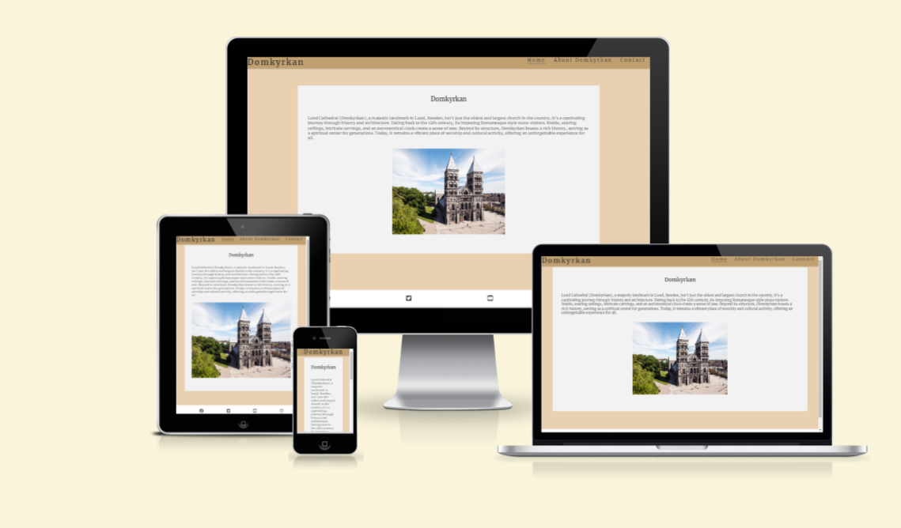

# *Domkyrkan*
This website explores the rich history and legendary tales entwined with Sweden's oldest church. The website gives a deep dive into the path the legend and the present surrounding Domkyrkan.

The site can be accessable by this [link](https://mattias-08.github.io/Project1finally/index.html)

---

## Features

+ ### Navbar

+ ##### Navigation
    - Positioned at the top of the page.
    - Contains navigation links on the right side:
        * HOME - leads to the home page where users can learn about the Domkyrkan and its history.
        * About Domkyrkan - leads to an information page displaying a summery of Domkyrkans history.
        * CONTACT - leads to the contact form page where users can give the company input.
    - The links have animated hover effect.
    - The navigation is easy to understand and simple.
    ![image navbar

        * On mobile devices: 
            - navigation bar has an X meny implemented on the left side.
            ![NavBar Mobile Closed](d
        
            - When the X menu is clicked, the dropdown menu falls down with the links in the same order.
            ![NavBar Mobile Open](do

 ### Home Page

    - Represent: 

        * How grand and beatiful the church is.
        * An introduktions to the churchs rich history.
        * Shows a front image of the church.

    
​
## Technologies Used

- [HTML](https://developer.mozilla.org/en-US/docs/Web/HTML) was used as the foundation of the site.
- [CSS](https://developer.mozilla.org/en-US/docs/Web/css) - was used to add the styles and layout of the site.
- [CSS Flexbox](https://developer.mozilla.org/en-US/docs/Learn/CSS/CSS_layout/Flexbox) - was used to arrange items simmetrically on the pages.
- [CSS Grid](https://developer.mozilla.org/en-US/docs/Web/CSS/grid) - was used to make "gallery" and "contact" pages responsive. 
- [Git](https://git-scm.com/) was used for the version control of the website.
- [GitHub](https://github.com/) was used to host the code of the website.

hmm dubbelkolla sen
- [GIMP](https://www.gimp.org/) was used to make and resize images for the README file.

---

## Design

### Color Scheme

- Soft blue color was used as the main color of the website due to its phycological effect on people's minds. As this color is associated with trustworthiness and reliability, website visitors could build a firm believe in the organization "Animal Shelter".

- Light Blue Color was used as a background color since this color creates a sense of tranquility and makes a connection between animal's ownership and peacefulness.

- Purple color was used to make an emphasis on the logo and leave a memorable effect on the website visitors.

### Typography

- Lato Google Font was used as the main font of the website in order to increase readability of the content on the pages.

- Lobster Google Font was used to attract viewers' attention to the company's logo, to make an accent on the strong points of the company, and to incentivize visitors to contact "Animal Shelter".

---

## Testing

Please refer to the [TESTING.md](TESTING.md) file for all test-related documentation.

---

## Deployment

### Deployment to GitHub Pages

- The site was deployed to GitHub pages. The steps to deploy are as follows: 
  - In the [GitHub repository](https://github.com/Mattias-08/Project1finally), navigate to the Settings tab 
  - From the source section drop-down menu, select the **Main** Branch, then click "Save".
  - The page will be automatically refreshed with a detailed ribbon display to indicate the successful deployment.

The live link can be found [here](https://github.com/Mattias-08/Project1finally)

### Local Deployment

In order to make a local copy of this project, you can clone it.
In your IDE Terminal, type the following command to clone my repository:

- `git clone https://github.com/Mattias-08/Project1finally.git`

- Alternatively, if you use Gitpod, you can [click here](https://mattias08-project1final-rjatp002dgm.ws-eu110.gitpod.io/), which will start the Gitpod workspace for you.

---

## Credits

+ #### Media

    - länkar för alla bilder

+ #### Acknowledgments

- [Code Institute](https://codeinstitute.net/) tutors and Slack community members for their support and help.
- mentor med link aegonbtrhobhtrywhbgpityrehnmw