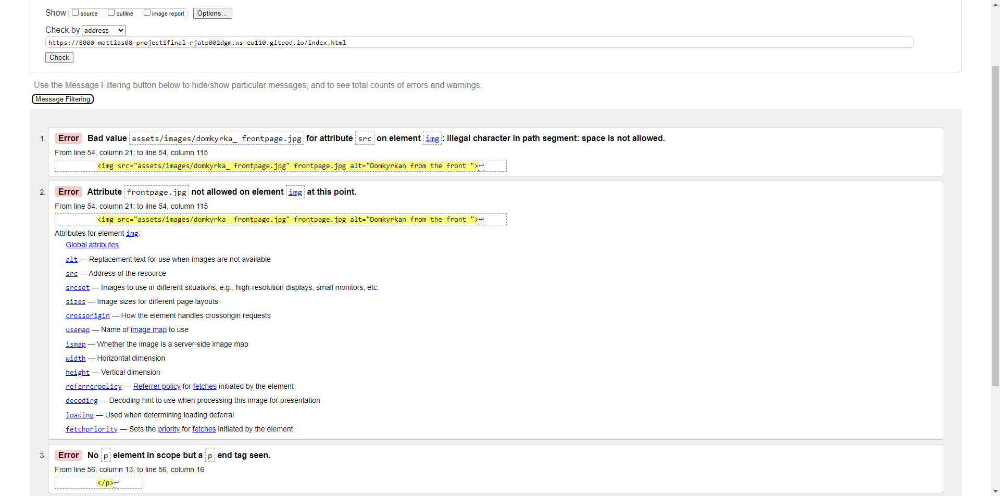
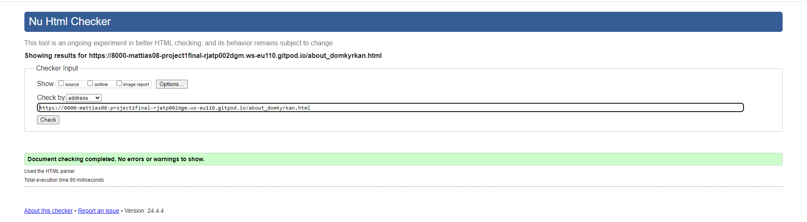
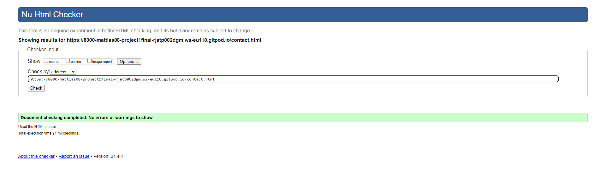
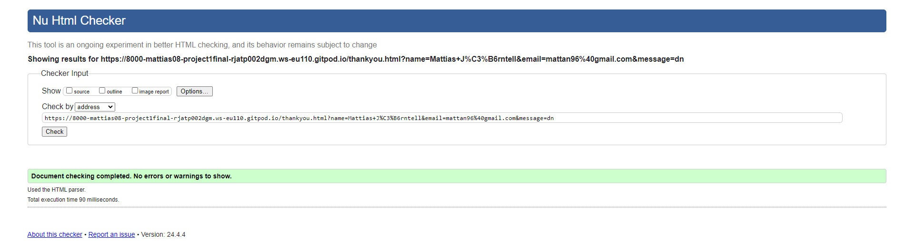
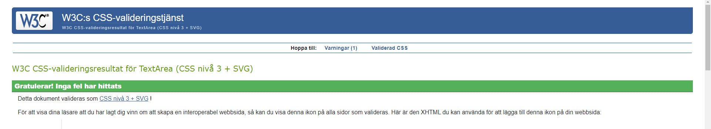
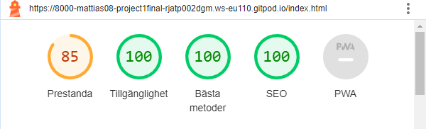
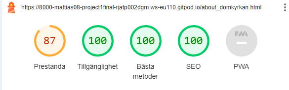
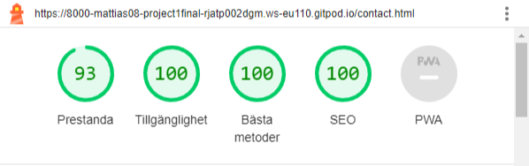
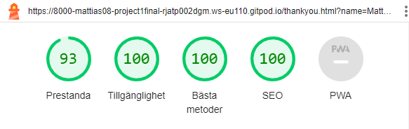

# TESTING

## Compatibility

In order to confirm the correct functionality, responsiveness, and appearance:

+ The website was tested on the following browsers: Chrome, Firefox, Brave.

    Im out of time it has been tested but i dont have time to find a god way to record and download.
## Responsiveness

+ The website was checked by devtools implemented in Firefox and Chrome browsers.

    Sane hear all the pages have been tested but not enough time to record and upload in a god way. 

     + The functionality of the links in the website was checked as well by different users.

## Manual testing

Manual testing have been done on all the features personally and by a friend to make that there are no interactice bugs.

---
## Validator testing
+ ### HTML
  #### Home Page
    - No errors or warnings were found when passing through the official W3C validator.

    
    
  #### About Page
    - No errors or warnings were found when passing through the official W3C validator.

    

  #### Contact Page
    - No errors or warnings were found when passing through the official W3C validator.

    

  #### Response Page
    - No errors or warnings were found when passing through the official W3C validator.

    
    
+ ### CSS
  No errors or warnings were found when passing through the official W3C (Jigsaw) validator except:
    
    - 1 warning about importet filles not getting looked thro instantly. Note that the page is in swedish and that i copied the css into the validator since im running out of time, apologies.

    - 

  
  
    - 43 warning regarding the use of *:root variables*: "Due to their dynamic nature, CSS variables are currently not statically checked".
    
  

+ ## LightHouse report

    - Using lighthouse in devtools I confirmed that the website is performing well, accessible and colors and fonts chosen are readable.
    
  ### Home page

  

  ### About page

  

  ### Contact page

  

  ### Response page

  

---
​